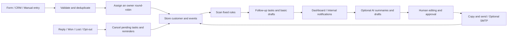

# Sales Follow-up OS

**AI-assisted sales follow-up that gives every new lead, quote, and meeting a clear next step.**

Brand-neutral sales follow-up automation for small teams. Deterministic reminders, a Chinese-language dashboard, optional AI summaries, reviewed email delivery, n8n templates, and an installable agent skill.

## What it does

| Scenario | Default rule | Result |
| --- | --- | --- |
| A new lead has not been contacted | 10 minutes | Create an overdue first-contact task for the owner |
| A quote has no reply | Days 3 / 7 / 14 after the quote | Staged reminders with editable message drafts |
| A meeting ends without a next step | 24 hours | Remind the team to assign an owner and schedule the next action |
| A scheduled next step is overdue | At the specified deadline | Create a reminder |
| A customer replies, a deal is won or lost, or a customer opts out | On receipt of the corresponding event | Cancel pending tasks and unsent notifications |
| A notification fails | Exponential backoff, up to 5 attempts | Show the failure in the dashboard and allow manual retries |

This is a runnable, single-team MVP. The accompanying [index of 50 resources](docs/resources-50.md) supports tool selection; it is not a collection of 50 finished SaaS applications. The core system is an original implementation and does not copy third-party template source code.

## Local quick start

Requires Python 3.10+. The application uses only the Python standard library at runtime, so no Python dependencies need to be installed.

```bash
git clone https://github.com/trsgogogo/sales-followup-os.git
cd sales-followup-os
cp .env.example .env
```

Edit `.env`. Generate a random `FOLLOWUP_API_TOKEN` with the following command and replace the example value:

```bash
python3 -c 'import secrets; print(secrets.token_urlsafe(32))'
```

Load the configuration and start the server on macOS or Linux. Quote any values containing spaces in `.env`.

```bash
set -a
. ./.env
set +a
python3 -m followup.server
```

Open <http://127.0.0.1:8080> and enter the token from `.env`. After you add a lead, the background process checks for due tasks every 30 seconds. By default, reminders appear only in the local dashboard. AI, webhooks, and SMTP are optional.

On Windows PowerShell, set environment variables such as `$env:FOLLOWUP_API_TOKEN` directly, then run `python -m followup.server`. Alternatively, use Docker Compose.

## Run with Docker

Configure `.env` first, then run:

```bash
docker compose up -d --build
docker compose logs -f
```

The default configuration binds to `127.0.0.1:8080` only and stores SQLite data in a persistent volume. For remote access, place an HTTPS reverse proxy in front of the application. Do not expose the Python standard-library HTTP server directly to the public internet.

## From lead intake to the next action



1. Add a lead in the dashboard, or connect a form or CRM through `POST /api/leads`.
2. Configure `SALES_OWNERS` to assign new leads round-robin. You can also specify an owner for an individual lead.
3. Record the corresponding event after contacting a customer, sending a quote, or holding a meeting. **Reading an internal notification does not count as contacting the customer.**
4. Due tasks show customer context and a basic message draft. Use the dashboard's summary-and-draft action to call your configured model.
5. Edit and approve the draft. Copy it into your existing channel, or use the SMTP send button if email sending is enabled.
6. Your mailbox or CRM integration must submit a `reply` event when a real customer reply arrives. This cancels the pending follow-up sequence. Submit `optout` for an unsubscribe.
7. If a customer has replied but the deal still needs work, the owner should schedule an explicit `next_step` instead of continuing the unanswered-quote sequence.

## Configuration

| Variable | Purpose |
| --- | --- |
| `FOLLOWUP_API_TOKEN` | Required; at least 24 characters. One shared team token protects all customer APIs. |
| `SALES_OWNERS` | Comma-separated list of owners |
| `FIRST_RESPONSE_MINUTES` | First-contact deadline in minutes; default: `10` |
| `QUOTE_FOLLOWUP_DAYS` | Quote follow-up days; default: `3,7,14` |
| `MEETING_NEXT_STEP_HOURS` | Hours before a reminder for a meeting without a next step; default: `24` |
| `NOTIFY_WEBHOOK_URL` | Optional HTTPS endpoint for internal notifications |
| `NOTIFY_FORMAT` | `generic` / `slack` / `feishu` / `wecom` |
| `LLM_URL` / `LLM_API_KEY` / `LLM_MODEL` | Optional Chat Completions-compatible model; the URL must include the full endpoint path |
| `ENABLE_EMAIL_SEND` | Defaults to `false`; set to `true` to enable SMTP sending |
| `SMTP_HOST` / `SMTP_PORT` / `SMTP_USER` / `SMTP_PASSWORD` / `SMTP_FROM` | SMTP with STARTTLS; default port: `587` |

If AI is not configured or a model call fails, the application falls back to basic templates and scheduled reminders continue to work. AI output is a suggestion, not verification of product claims. The model receives the current customer record and the 12 most recent events; use this feature only for information you intend to share with that model provider.

## n8n, Activepieces, and the agent skill

- [n8n templates](workflows/n8n/): lead intake, customer event intake, scheduled scans, and internal notification forwarding.
- [Integration guide](docs/integrations.md): credentials, CRM and email event mapping, and Activepieces setup.
- [API and state semantics](docs/api.md): endpoints and stop conditions.
- [Operations guide](docs/operations.md): backups, failure recovery, and deployment scope.
- [Agent skill](skills/sales-followup/SKILL.md): instructions for operating a deployed system consistently.

Install the skill in a tool that supports the Skills CLI:

```bash
npx skills add https://github.com/trsgogogo/sales-followup-os --skill sales-followup
```

You can also copy `skills/sales-followup` into your tool's supported skill directory manually. Installing the skill does not deploy the application or start a background scheduler.

## Validation

```bash
python3 -m unittest discover -s tests -v
python3 scripts/validate_workflows.py
node --check followup/static/app.js
```

Tests cover deadline boundaries, deduplication, round-robin assignment, cancellation after replies, quote resets, meeting tasks, snoozing, notification retries, approval invalidation after context changes, uncertain SMTP delivery, persistence, concurrent scans, and API authentication. External models, email services, and notification bots use test doubles; tests do not send messages to real customers.

## Current limitations

- One instance, one team, and one shared token. Individual user accounts, fine-grained permissions, and multi-tenant isolation are not implemented.
- Business hours, holidays, and quiet hours are not implemented. Rules use continuous UTC time; the dashboard displays dates in the browser's local time zone.
- Reply detection depends on external mailbox or CRM triggers. The application does not independently read Gmail, LinkedIn, personal WeChat, or X messages.
- Reminder notifications use at-least-once delivery. Network timeouts can cause duplicate messages in third-party bots; generic webhook receivers should deduplicate by `event_id`.
- SMTP delivery requires human approval followed by a separate send action. Failed or restart-interrupted sends are marked `delivery_unknown`; check the email provider before retrying.
- The n8n files have passed JSON and connection-structure checks. Import behavior and credentials must be verified in the target n8n instance.
- Docker configuration and CI are included. Live integration testing with external services requires your own account configuration.

## License

MIT. See [LICENSE](LICENSE). The third-party resource index links to original sources; their existing licenses remain unchanged.
