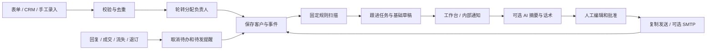

# Sales Follow-up OS

**通用 AI 销售跟进系统：让新线索、报价和会后行动都有下一步。**

Brand-neutral sales follow-up automation for small teams. Deterministic reminders, a Chinese dashboard, optional AI summaries, reviewed email delivery, n8n templates, and an installable agent skill.

## 能做什么

| 场景 | 默认规则 | 结果 |
| --- | --- | --- |
| 新线索无人联系 | 10 分钟 | 负责人收到首响超时任务 |
| 报价没有下文 | 报价后 3 / 7 / 14 天 | 分阶段提醒与可编辑话术 |
| 会议结束无下一步 | 24 小时 | 提醒安排负责人和后续时间 |
| 约定的下一步逾期 | 到指定时间 | 到期提醒 |
| 客户回复、成交、流失、退订 | 收到对应事件 | 取消待办及尚未发出的通知 |
| 通知失败 | 指数退避，最多 5 次 | 工作台可见失败并可手动重试 |

本项目是可运行的单团队 MVP，不是 50 个成品 SaaS 的集合。附带的 [50 项资源索引](docs/resources-50.md) 是选型资料；核心系统为原创实现，不复制第三方模板源码。

## 5 分钟本地启动

要求 Python 3.10+，运行时只使用标准库，不需要安装 Python 依赖。

```bash
git clone https://github.com/trsgogogo/sales-followup-os.git
cd sales-followup-os
cp .env.example .env
```

编辑 `.env`，用下面命令生成随机 `FOLLOWUP_API_TOKEN`，替换示例值：

```bash
python3 -c 'import secrets; print(secrets.token_urlsafe(32))'
```

加载配置并启动（macOS / Linux；`.env` 的含空格值需要引号）：

```bash
set -a
. ./.env
set +a
python3 -m followup.server
```

打开 <http://127.0.0.1:8080>，输入 `.env` 中的 Token。新增线索后，后台每 30 秒检查一次到期任务。默认只在本地工作台显示提醒，AI、Webhook、SMTP 均为可选项。

Windows PowerShell 可直接设置 `$env:FOLLOWUP_API_TOKEN` 等环境变量，再运行 `python -m followup.server`；或者使用 Docker Compose。

## Docker 启动

```bash
docker compose up -d --build
docker compose logs -f
```

同样先配置 `.env`。默认只发布 `127.0.0.1:8080`，SQLite 数据保存在持久卷。远程使用时在前面配置 HTTPS 反向代理；不要直接将 Python 标准库 HTTP 服务暴露到公网。

## 从线索到成交的流程



1. 在工作台添加线索，或通过 `POST /api/leads` 接入表单 / CRM。
2. 配置 `SALES_OWNERS`，新线索自动轮转分配；也可单独指定负责人。
3. 完成联系、报价、会议后，记录对应事件。**系统不会把内部消息已读误认为销售已联系客户。**
4. 到期任务展示客户背景和基础话术。点击“生成摘要与草稿”可使用已配置的模型。
5. 编辑草稿后批准；可复制到现有渠道发送，或使用开启后的 SMTP 发送按钮。
6. 邮箱 / CRM 的真实回复需通过集成发送 `reply` 事件，随后自动取消后续追踪。退订发 `optout`。
7. 客户已回复但仍需推进时，由负责人安排明确的 `next_step`，不继续原来的未回复催促序列。

## 配置

| 变量 | 用途 |
| --- | --- |
| `FOLLOWUP_API_TOKEN` | 必填，至少 24 字符，所有客户 API 共用一个团队令牌 |
| `SALES_OWNERS` | 逗号分隔的负责人列表 |
| `FIRST_RESPONSE_MINUTES` | 首响超时，默认 10 |
| `QUOTE_FOLLOWUP_DAYS` | 报价提醒天数，默认 `3,7,14` |
| `MEETING_NEXT_STEP_HOURS` | 会后缺少下一步的提醒，默认 24 |
| `NOTIFY_WEBHOOK_URL` | 可选 HTTPS 内部通知地址 |
| `NOTIFY_FORMAT` | `generic` / `slack` / `feishu` / `wecom` |
| `LLM_URL` / `LLM_API_KEY` / `LLM_MODEL` | 可选 Chat Completions 兼容模型；URL 包括完整路径 |
| `ENABLE_EMAIL_SEND` | 默认 `false`；启用 SMTP 发送需设置为 `true` |
| `SMTP_HOST` / `SMTP_PORT` / `SMTP_USER` / `SMTP_PASSWORD` / `SMTP_FROM` | SMTP STARTTLS，默认 587 端口 |

AI 未配置或调用失败时退回基础模板，定时提醒继续工作。AI 输出是建议，不代表产品事实已被验证。模型会接收当前客户资料和最近 12 条事件；只把准备交给该模型供应商处理的资料接入此功能。

## n8n、Activepieces 与 Skill

- [n8n 模板](workflows/n8n/)：线索入口、客户事件入口、定时扫描、内部通知转发。
- [集成配置指南](docs/integrations.md)：凭据、CRM / 邮件事件映射、Activepieces 搭建方式。
- [API 与状态语义](docs/api.md)：所有接口和停止规则。
- [运维说明](docs/operations.md)：备份、失败恢复和部署范围。
- [Agent Skill](skills/sales-followup/SKILL.md)：让助手按同一套规则操作已部署系统。

安装 Skill 到支持 Skills CLI 的工具：

```bash
npx skills add https://github.com/trsgogogo/sales-followup-os --skill sales-followup
```

也可以手动复制 `skills/sales-followup` 到工具支持的技能目录。安装 Skill 不会自动部署应用或建立后台定时服务。

## 验证

```bash
python3 -m unittest discover -s tests -v
python3 scripts/validate_workflows.py
node --check followup/static/app.js
```

测试覆盖边界时间、去重、负责人轮转、回复停止、报价重置、会议待办、延期、通知重试、上下文更新撤销批准、SMTP 不确定结果处理、数据持久化、并发扫描和 API 认证。外部模型、邮件与机器人使用测试替身，不会向真实客户发送消息。

## 当前边界

- 单实例、单团队、共享 Token；尚未实现用户账号、细粒度权限和多租户隔离。
- 工作日、节假日和免打扰时段尚未实现；规则按 UTC 持续计时，工作台用浏览器本地时区显示。
- 邮件回复检测依赖外部邮箱 / CRM 触发器，不会自行读取 Gmail、LinkedIn、个人微信或 X。
- 提醒通知采用至少一次投递。网络超时可能使第三方机器人重复收到消息；通用 Webhook 接收方应按 `event_id` 去重。
- SMTP 由人批准后单独发送，不是无人审核的自动营销序列；发送失败或重启中断时标记 `delivery_unknown`，需先在邮件服务商核实。
- n8n 文件经过 JSON 和连接结构检查；不同 n8n 版本的导入及凭据需在目标实例验证。
- Docker 配置和 CI 已提供，实际外部服务联调需要你自己的账号配置。

## License

MIT，见 [LICENSE](LICENSE)。第三方资源索引仅链接来源，其原有许可证不变。
